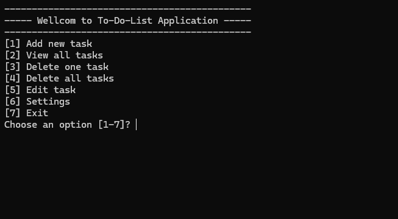
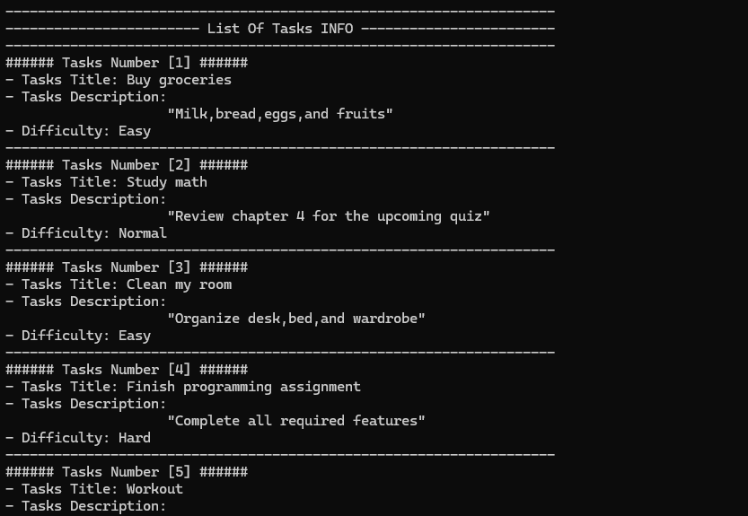

# 📝 Simple To-Do Manager  
*A beginner-friendly Batch File task manager*

---

## 📌 About the Project
**Simple To-Do Manager** is a small command-line application built entirely using  
**Windows Batch File (.bat)**.  
The project was created to help me practice Batch scripting and understand how  
menus, file handling, and simple text-based data structures work.

This application lets you manage tasks using a straightforward interface inside CMD.  
It supports adding tasks, viewing them, deleting specific ones, clearing the entire list,  
and even editing any task through a structured update menu.

This project is beginner-friendly and great for learning how Batch logic works.

---

## ✨ Features

- ➕ Add new tasks (title + description + difficulty)
- 📄 View all tasks in a clean formatted layout  
- ❌ Delete a specific task by its number  
- 🗑️ Remove all tasks at once  
- ✏️ Edit any part of an existing task  
- 🎨 Customize the theme and font colors  
- 💾 Tasks stored in a simple, readable text-based format  

---

Where:
- **Difficulty:**
  - 1 = Easy
  - 2 = Normal
  - 3 = Hard
---

## 📸 Screenshots

  

  

---

## 💻 How It Works

The program uses a text-based menu that allows you to:

1. Add a new task
2. View all saved tasks
3. Delete a task by number
4. Edit any task (title, description, or difficulty)
5. Clear all tasks
6. Customize theme and font colors

The application rebuilds the entire task file when deleting or updating tasks.
This ensures the tasks remain clean and in the correct order.

---

## 📁 File Structure
for example:
  Study math#Final exam tomorrow#2

## 🎯 Purpose

This project was created to learn and practice:

- Batch scripting basics  
- Text processing using `for /f`  
- Organizing multi-field data  
- Building user interfaces inside CMD  

---

## ⚠️ Notes

- This program is for **learning purposes only**  
- The task data is stored in plain text  
- No real security features are included  

---

## 🙌 Thank You!

Thanks for checking out my project—I'm still learning,  
so feedback and suggestions are always welcome! 😊
